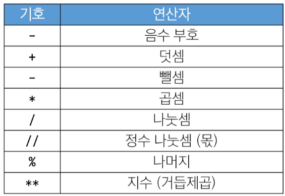
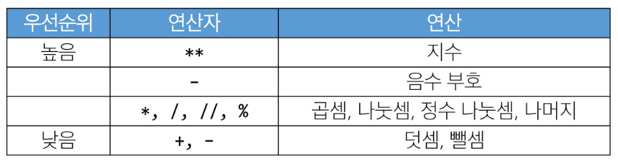
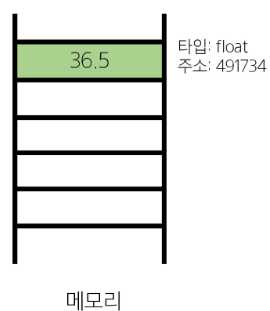
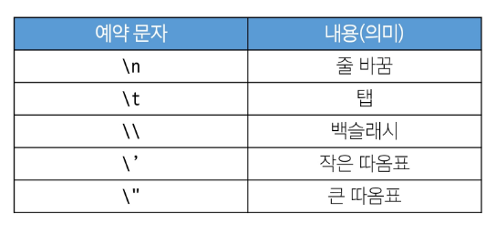
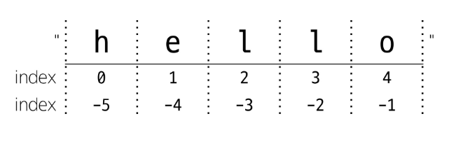
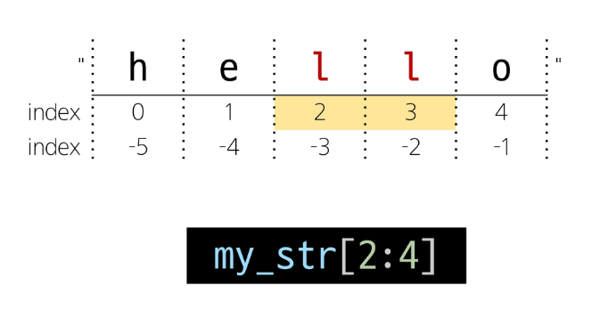
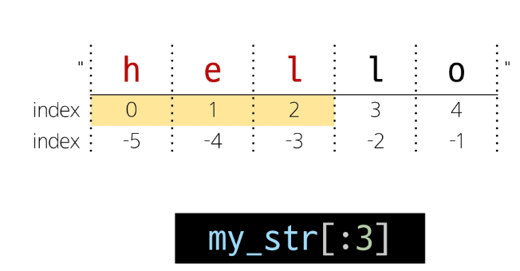
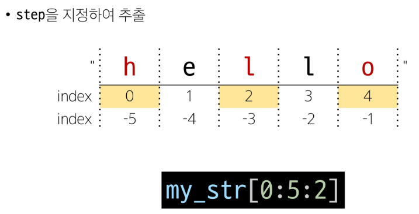
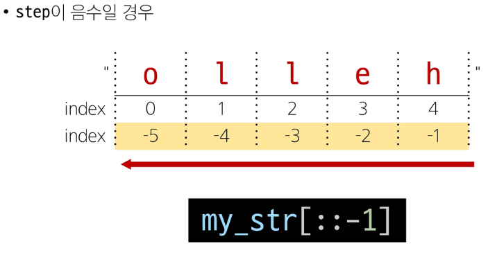
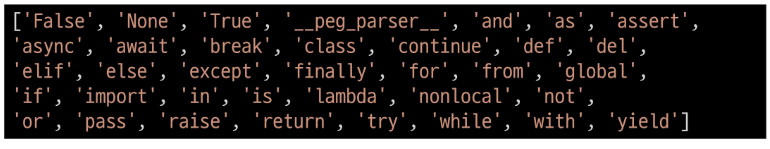

## 프로그래밍의 핵심
새 연산을 정의하고 조합해 유용한 작업을 수행하는 것


프로그래밍의 언어
- 컴퓨터에게 작업을 지시하고 문제를 해결하는 도구

<br/>

## 파이썬
읽기 쉽고 쓰기 쉬운 문법

웹개발, 데이터 분석, 인공지능에 활용

알고리즘 구현에 유리 (직관적, 빠른 프로토타입)

### 기본개념
- 표현식 : 값으로 평가될 수 있는 코드 조각 (3+5)
- 값 : 표현식이 평가된 결과 (8)

-> 표현식이 평가되어 값이 반환된다

- 평가 : 표현식을 실행하여 값을 얻는 과정.
표현식을 순차적으로 평가하여 프로그램의 동작을 결정

- 문장 : 실행 가능한 동작을 기술하는 코드 (조건문, 반복문, 함수 정의 등)
-> 문장은 보통 여러개의 표현식을 포함
- 타입 : 변수나 값이 가질 수 있는 데이터의 종류 -> 타입은 2가지 요소로 이뤄짐: '값'과 '값에 적용할 수 있는 연산'

<br/>

### 연산자





예시)

-2 ** 4 = -16
지수 부터 연산이 되기 때문에. 음수 부호가 나중에 붙는다.

-(2 ** 4) = -16 , (-2) ** 4 = 16

괄호를 붙여 명시적으로!

<br/>

#### 변수 할당
표현식을 통해 변수에 값을 저장

- degrees = 36.5

-> 변수 degrees 에 값 36.5를 할당했다
라고 생각해야 함

- degrees = 'abc'

-> 변수 degrees에 값 abc를 __재할당__ 했다

<br/>

#### 할당문
할당 연산자(=) 오른쪽에 있는 표현식을 평가해서 값(메모리 주소)을 생성

- 존재하지 않는 변수 (할당): 새 변수를 생성
- 기존에 존재했던 변수 (재할당): 변수 재사용하여 변수에 들어있는 메모리 주소 변경

#### 객체
타입을 갖는 메모리 주소 내 값

값이 들어있는 상자



- 변수는 그 변수가 참조하는 객체의 메모리 주소를 갖는다

#### 변수
값을 **참조**하기 위한 이름

__변수의 재할당__
<br/>

```python
number = 10
double = 2 * number  # double은 여기서 할당 끝
print(double)

number = 5  # number만 재할당 됐을 뿐. 연동 되지 않아!
print(double) #?? 답은 20!!
```

#### data type
값의 종류와 그 값에 적용 가능한 연산과 동작을 결정하는 속성
- 값들을 구분, 어떻게 다뤄야 하는지
- 각 데이터 타입은 각자에게 적합한 도구를 가짐
- 코드를 읽는 사람이 변수의 의도를 쉽게 이해

### 데이터 타입
#### 1. Numeric type
- int (정수)
  = integer
  - 진수 표현
    - 2진수 print(0b10) #2
    - 8진수 print(0o30) #24
    - 16진수 print(0x10) #16

2. float (실수)
- 실수를 표현하는 자료형 = 실수에 대한 __근삿값__
- 지수 표현 방식
```python
#314 * 0.01
number = 314e-2
print(number) #3.14

print(type(number)) #float
```
- **유한 정밀도**

컴퓨터 메모리 용량이 한정돼 잇고 한 숫자에 대해 저장하는 용량이 제한됨
```python
#0.666666666
print(2/3)
```
10진수의 0.1은 2진수로 표현하면 0.00011001100...같이 무한대로 반복,
사람이 사용하는 10진법의 근삿값만 표시

#### **부동소수점 에러**

컴퓨터가 실수를 표현하는 방식으로 인해 발생하는 작은 오차 (실수를 2진수로 변환하는 과정에서 발생하는 근사치 표현)

```python
a = 3.2 - 3.1
b = 1.2 - 1.1

print(a) #0.1000000000009
print(b) #0.0999999999987
print(a == b) #False
```
해결방안
```python
from from decimal import Decimal

a = Decimal('3.2') - Decimal('3.1')
b = Decimal('1.2') - Decimal('1.1')

print(a)  # 0.1
print(b)  # 0.1
print(a == b)  # True
```

3. complex (복소수)

<br/>

#### 2. Sequence types
여러 개의 값들을 순서대로 나열하여 저장하는 자료형
(__str, list, tuple, range__)

  1. 순서 (sequence)
  - 값들이 순서대로 저장 (정렬x)

  2. 인덱싱 (indexing) 
  - 각 값에 고유한 인덱스를 가지고 있다. 인덱스 이용해 위치값 선택,수정

  3. 슬라이싱 (slicing)
  - 인덱스 범위를 조절해 부분적인 값을 추출할 수 있음

  4. 길이 (length)
  - len() 함수를 사용하여 저장된 값의 개수를 구함

  5. 반복 (iteration)
  - 반복문을 사용해 저장된 값 반복적으로 처리

<br/>

### str
문자들의 순서(sequence)가 있는 변경불가능한 시퀀스 자료형
```python
# 문자열 표현
print('Hello, World!')  # Hello, World!
print(type('Hello, World!'))  # str

# 중첩 따옴표
print(
    '문자열 안에 "큰따옴표"를 사용하려면 작은 따옴표로 묶는다.'
)  # 문자열 안에 "큰따옴표"를 사용하려면 작은 따옴표로 묶는다.
print(
    "문자열 안에 '작은따옴표'를 사용하려면 큰따옴표로 묶는다."
)  # 문자열 안에 '작은따옴표'를 사용하려면 큰따옴표로 묶는다.
```
<br/>

#### + Escape Sequence

```python
print('철수야 \'안녕\'') #철수야 '안녕'
print('이 다음은 엔터\n입니다.') #이 다음은 엔터
#입니다
```
<br/>

#### ⭐ String Interpolation
문자열 내에 변수나 표현식(자체를)을 삽입하는 방법
```python
#f-string
bugs = 'roaches'
counts = 13
area = 'living room'

print(f'Debugging {bugs} {counts} {area}') #Debugging roaches 13 living room
```
<br/>

#### 인덱스 (index)
시퀀스 내의 값들에 대한 고유한 번호.
각 값의 위치를 식별하는 데 사용되는 숫자


#### 슬라이싱 (slicing)
시퀀스의 일부분을 선택하여 추출

-> 시작과 끝을 지정하여 해당 범위의 값을 포함하는 새로운 시퀀스 생성




python만 슬라이싱으로 문자열 뒤집기 가능 
<br/>

#### 문자열의 시퀀스 특징
```python
my_str = 'hello'
# 1. 인덱싱
print(my_str[1])  # e

# 2. 슬라이싱
print(my_str[2:4])  # ll
print(my_str[:3])  # hel
print(my_str[3:])  # lo
print(my_str[0:5:2])  # hlo
print(my_str[::-1])  # olleh

# 3. 길이
print(len(my_str))  # 5

# 4. 문자열은 불변
my_str[1] = 'z' 
# TypeError: 'str' object does not support item assignment
# 'hzllo' e를 z로 요소를 변경할 수 없음 
# 재할당 (문자열을 바꾼것이 아님)
my_str = 'hzllo'
```

➕ **참고**

파이썬 style guide
- 변수명은 무엇을 위한 변수인지 직관적인 이름을 가져야함
- 공백 4칸을 사용하여 코드 블록을 들여쓰기
- 한 줄의 길이는 79자로 제한하며, 길어질 경우 줄바꿈 사용
- 문자와 밑줄_ 을 사용하여 함수, 변수, 속성의 이름을 작성
- 함수 정의나 클래스 정의 등의 블록 사이에는 빈 줄 추가

변수명 규칙
- 영문 알파벳, 언더바, 숫자로 구성
- 숫자로 시작 x
- 대소문자 구불
- 예약어를 변수로 사용 안돼

