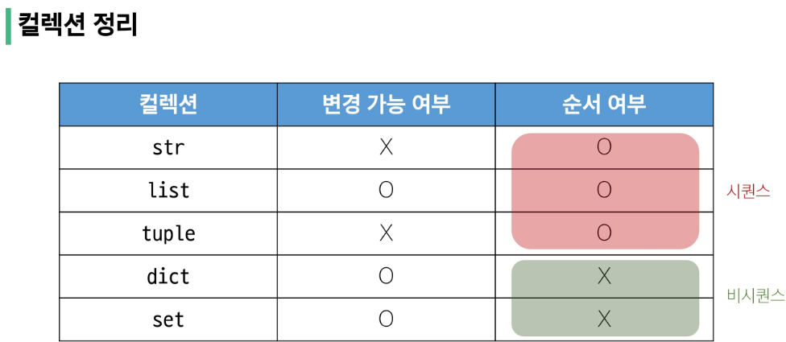
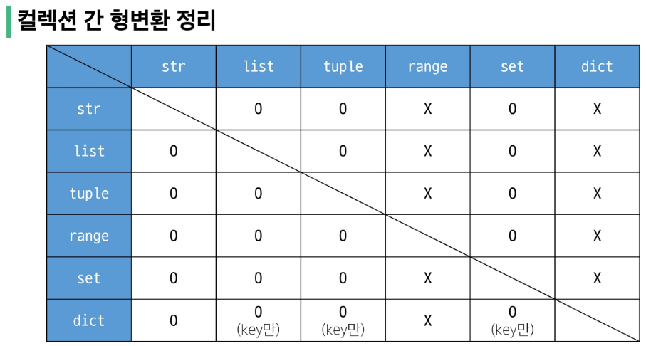
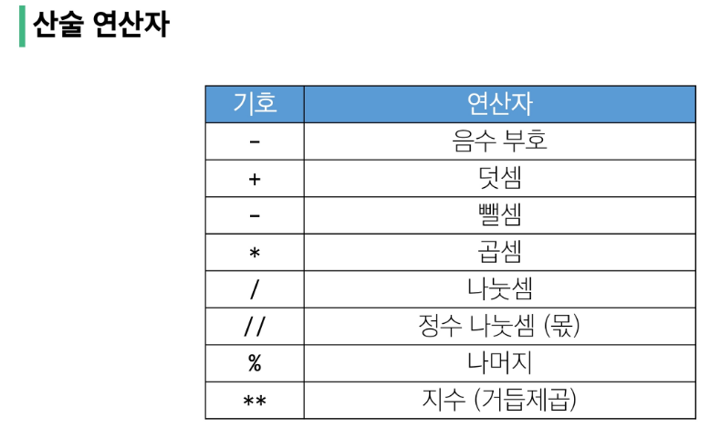
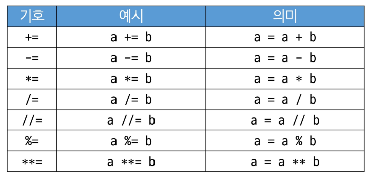
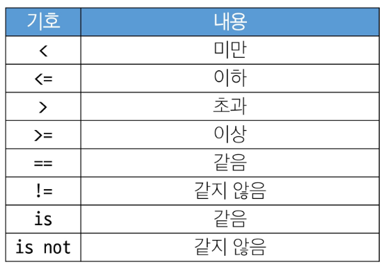
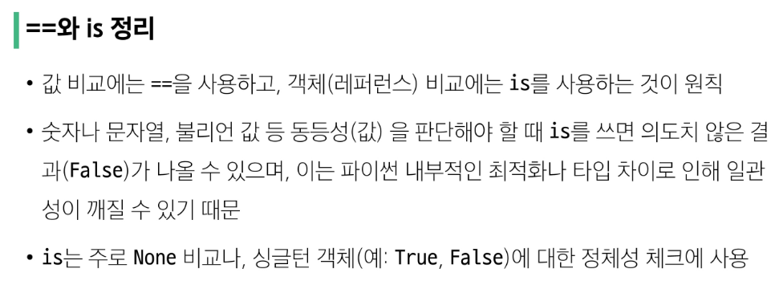
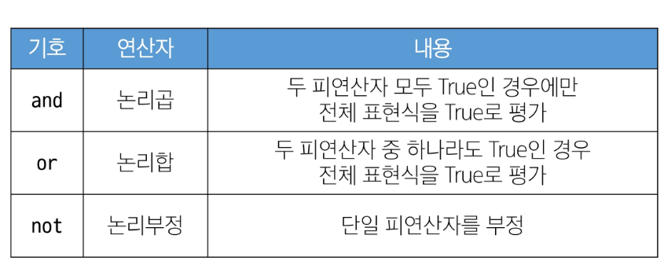
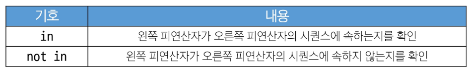
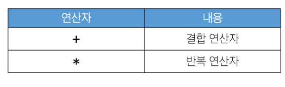

#### Sequence type
## ❣️2. 리스트❣️
여러 개의 값을 순서대호 저장하는 **변경 가능한⭐** 시퀀스 자료형  
😂얘만 가변?

#### 리스트 표현
데이터는 어떠한 자료형도 저장가능
```python
my_list_1 = []
my_list_2 = [1, 'a', 3.5, 'b', 5]
my_list_3 = [1, 2, 3,'Python', ['hello', 'world']]
```
### 리스트의 시퀀스 특징
```python
my_list = [1, 'a', 3, 'b', 5]
# 인덱싱
print(my_list[1])  # a

# 슬라이싱
print(my_list[2:4])  # [3, 'b']
print(my_list[:3])  # [1, 'a', 3]
print(my_list[3:])  # ['b', 5]
print(my_list[0:5:2])  # [1, 3, 5]
print(my_list[::-1])  # [5, 'b', 3, 'a', 1]  #오름/내림차순 아니구 걍 거꾸로

# 길이
print(len(my_list))  # 5

# 중첩된 리스트 접근
my_list = [1, 2, 3, 'Python', ['hello', 'world', '!!!']]
print(len(my_list))  #5  요소가 몇개!
print(my_list[4][2])  # !!! #print(my_list[4][-1])
print(my_list[4][1][0])  # w  #print(my_list[-1][-1][0])

# 리스트는 가변
my_list = [1, 2, 3]
my_list[0] = 100
print(my_list) # [100, 2, 3]  # str 은 안됐지만 list는 가변
```
리스트 = [주소0, 주소1, 주소2]

<br/>

#### ➕ 3. 튜플 Tuple
여러개의 값을 순서대로 저장하는 변경 불가능한 시퀀스 자료형
- 0개 이상의 객체를 포함하며 데이터 목록을 저장
- 소괄호 (()) 표기
- 어떠한 자료형도 저장 가능
- 단일 요소 튜플 만들때 **후행 쉼표!**
    - (1) -> int 
    - (1,) -> tuple
```python
# 튜플 표현
my_tuple_1 = ()
my_tuple_2 = (1,)
my_tuple_3 = (1, 'a', 3, 'b', 5)
```

> 언제 사용하나?

개발할때 거의 안씀.

불변 특성을 사용하여 **✅내부 동작**과 안전한 데이터 전달에 사용. 내부적으로 알아서 ~

다중 할당. 값교환, 그룹화, 함수 다중 반환 값 등

ex
```python
# 다중 할당 
x, y = 10, 20  #괄호 있어도 되고,,
print(x)  # 10
print(y)  # 20
# 실제 내부 동작
(x, y) = (10, 20)

# 값 교환
x, y = 1, 2
x, y = y, x
# 실제 내부 동작
temp = (y, x)  # 튜플 생성
x, y = temp  # 튜플 언패킹
print(x, y)  # 2 1

# 그룹화
student = ('Kim', 20, 'CS')
name, age, major = student  # 언패킹
print(name, age, major)  # Kim 20 CS
```
<br/>

## 3. range
연속된 정수 시퀀스를 생성하는 변경 불가능한 자료형
- 모든 매개변수는 정수만 사용가능

함수 형태
```python
range(시작값, 끝값, 증가값)  #slicing 과 비슷?
```
<br/>

#### range 매개변수별 특징
- range(n)
    - 0부터 n-1까지 1씩 증가
```python
my_range_1 = range(5)
```

- range(n,m)
    - n부터 m-1까지의 1씩 증가
```python
my_range_2 = range(1, 10)
```
- range(n, m, step)
    - n부터 m-1까지의 1씩 증가
```python
my_range_3 = range(5, 0, -1)
```


```python
print(my_range_1)  # range(0, 5)
print(my_range_2)  # range(1, 10)
print(my_range_3)  # range(5, 0, -1)

# 리스트로 형 변환 시 데이터 확인 가능
print(list(my_range_1))  # [0, 1, 2, 3, 4]
print(list(my_range_2))  # [1, 2, 3, 4, 5, 6, 7, 8, 9]
print(list(my_range_3))  # [5, 4, 3, 2, 1]
```

#### 증가 값 규칙
- 기본 증가값 1
- 음수 증가값 - 감소하는 수열 생성
- 양수 증가값 - 증가하는 수열 생성
- 증가값 0 = 에러

#### 값의 범위 규칙
- 음수 증가시 - 시작 값이 끝값보다 크기
- 양수 증가시 - 시작 값이 끝보다 커야함
```python
# 음수 증가 시
# 시작 값이 끝 값보다 큰 경우 (정상)
print(list(range(5, 1, -1)))  # [5, 4, 3, 2]
# 시작 값이 끝 값보다 작은 경우
print(list(range(1, 5, -1)))  # []


# 양수 증가 시
# 시작 값이 끝 값보다 작은 경우 (정상)
print(list(range(1, 5)))  # [1, 2, 3, 4]
# 시작 값이 끝 값보다 큰 경우
print(list(range(5, 1)))  # []
```

```python
# 주로 반복문과 함께 활용 예정
for i in range(1, 10):
    print(i)  # 1 2 3 4 5 6 7 8 9  #9번반복복

for i in range(1, 10, 2):
    print(i)  # 1 3 5 7 9
```

# Non-Sequence type
## 1. dict
key-value 쌍으로 이루어진

⭐***순서***와 ***중복이 없는***

 **변경 가능한** 자료형⭐
 
 <br/>

### 딕셔너리 표현
- key는 변경 불가능한 자료형만 사용가능 (str,int,float,tuple,range)
- value는 모든 자료형 가능
- 중괄호 {} 표기
```python
my_dict_1 = {}
my_dict_2 = {'key':'value'}
my_dict_3 = {'apple':12, 'list':[1,2,3]}

print(my_dict_1)  # {}
print(my_dict_2)  # {'key':'value'}
print(my_dict_3)  # {'apple':12, 'list':[1,2,3]}
```
list에서 각자의 데이터의 이름을 붙이자~ 해서 dict 등장

#### 딕셔너리 사용
key를 통해 value 에 접근!
```python
# 딕셔너리는 키에 접근해 값을 얻어냄
my_dict = {'apple': 12, 'list': [1, 2, 3]}

print(my_dict['apple'])  #12
print(my_dict['list'])  #[1, 2, 3]
print(my_dict['list'][1]) #2만 추출하고플때. my_dict(['list']까지가 list라서 인덱싱 가능)
```
✅key 간에는 순서가 존재하지 않는다. 인덱싱 없어!!


```python
# 추가
my_dict['banana'] = 50
print(my_dict)  # {'apple': 12, 'list': [1, 2, 3], 'banana': 50}

# 변경
my_dict['apple'] = 100
print(my_dict)  # {'apple': 100, 'list': [1, 2, 3], 'banana': 50}
```
<br/>

### 2. set (집합 자료형)
**순서와 중복이 없는** 변경 가능한 자료형

- 수학에서의 집합과 동일한 연산 처리 가능
- 중괄호 {}로 표기

```python
# 세트 표현
my_set_1 = set()
my_set_2 = {1, 2, 3}
my_set_3 = {1, 1, 1}
print(my_set_1)  # set()
print(my_set_2)  # {1, 2, 3}
print(my_set_3)  # {1}  ✅중복이 불가!
```
```python
# 세트의 집합 연산산
my_set_1 = {1, 2, 3}
my_set_2 = {3, 6, 9}

# 합집합 (중복이 안되니까 연산 가능~)
print(my_set_1 | my_set_2)  # {1, 2, 3, 6, 9}
# 1은 첫번째 요소인가? x 
# 순서 없음, 인덱스 없음

# 차집합
print(my_set_1 - my_set_2)  # {1, 2}

# 교집합
print(my_set_1 & my_set_2)  # {3}
```

<br/>

## Other types
### 1. None (N 꼭 대문자!)
파이썬에서 '값이 없음'을 표현하는 자료형
```
a=???  비워놓을순 없음
-> a = None
```
```python
# None
variable = None
print(variable)  # None
```

### 2. Boolean (T/F 대문자)
참(True)과 거짓(False)을 표현하는 자료형

- 비교/논리 연산의 평가 결과로 사용
- 주로 조건/반복문과 함께 사용

```python
# Boolean
bool_1 = True
bool_2 = False

print(bool_1)  # True
print(bool_2)  # False
print(3 > 1)  # True
print('3' != 3)  # True
```
<br/>

## Collection
여러개의 항목 또는 요소를 담는 구조


-> dict는 값자체 변경이 가능하기에.

> ❤️list와 dict의 사용!!!!이 알고리즘,API 중요


## 형변환 type conversion
한 데이터 타입을 다른 데이터 타입으로 변환하는 과정
### 1. 암시적 형변환
 파이썬이 자동으로

정수와 실수 연산. 
Boolean과 Numeric type으로 한정적
 ```python
 print(3 + 5.0)  # 8.0  
 print(True + 3) # 4
 print(True + False) # 1
 ```

 ## 2. 명시적 형변환
 프로그래머가 직접 지정

 - str -> int : 형식에 맞는 숫자만 가능

 ```python
 print(int('1')) #1

 #valueError: invalid literal for int() with base 10: '3.5'
 print(int('3.5')) 
 print(int(3.5)) #3
 print(float('3.5')) # 3.5
 ```
 - int -> str : 모두 가능
 ```python
 print(str(1)+'등') # 1등
 ```

외우지마
 

<br/>

# 연산자
## 1. 산술연산자


## 2. 복합연산자
연산과 할당을 함께 (명시도 down)


```python
# 복합 연산자
y = 10
y -= 4
# y = y - 4
print(y)  # 6

z = 7
z *= 2
# z = z * 2
print(z)  # 14

w = 15
w /= 4
# w = w / 4
print(w)  # 3.75

q = 20
q //= 3
# q = q // 3
print(q)  # 6
```

## 3. 비교 연산자


#### 1. == 비교연산자
- 값이 같은지를 비교
- 동등성
- 1==True와 같이 
 ```python
# == 비교 연산자
print(2.0 == 2)  # True
print(2 != 2)  # False
print('HI' == 'hi')  # False
```
#### 2. is 비교연산자
- 객체자체가 같은지를 비교
- 식별성
- 두변수가 동일한 메모리 주소를 가리키고 있을 때만 True
```python
# is 비교 연산자
# SyntaxWarning: "is" with a literal. Did you mean "=="?
print(1 is True)  # False
print(2 is 2.0)  # False

# 왜 is 대신 ==를 사용해야 하나?
print(1 is True)  # False
print(2 is 2.0)  # False
print(1 == True)  # True
print(2 == 2.0)  # True
```

> is 권장하지 않음

is는 숫자나 문자열 같은 값 자체를 비교할때는 적합하지 않음

> is는 언제 사용하는가?

1. None을 비교할때
2. 싱글턴 객체를 비교할때
    - 싱글턴: 프로그램 전체에 오직 1개만 존재하도록 만들어진 특별한 객체
        - None, True, False
```python
# is 연산자는 언제 사용하는가?
x = None

# 권장
if x is None:
    print('x는 None입니다.')

# 비권장
if x == None:
    print('x는 None입니다.')


# 싱글턴 객체
x = True
y = True

# True, False, None은 실제로 같은 객체를 가리킨다.
print(x is y)  # True
print(True is True)  # True
print(False is False)  # True
print(None is None)  # True
```

➕
```python
print(1 is 1) #True # 파이썬 버전에 따라 작은 범위의 주소는 메모리 주소 고정인 경우 있음


# 추가 예시: 리스트나 객체 비교
a = [1, 2, 3]
b = [1, 2, 3]

print(a == b)  # True (두 리스트의 값은 동일)
print(a is b)  # False (서로 다른 리스트 객체)

# b가 a를 그대로 참조하도록 할 경우
b = a
print(a is b)  # True (같은 객체를 가리키므로 True)
```




## 4. 논리 연산자


```python
print(True and False)  # False
print(True or False)  # True
print(not True)  # False
print(not 0)  # True
```

```python
# 논리 연산자 & 비교 연산자
num = 15
result = (num > 10) and (num % 2 == 0)
print(result)  # False

name = 'Alice'
age = 25
result = (name == 'Alice') or (age == 30)
print(result)  # True
```
<br/>

#### 단축평가
논리연산에서 두번째 피연산자를 평가하지 않고 결과를 결정하는 동작

for 코드 실행 최적화, 불필요한 연산 피하기기
```python
# 단축 평가

vowels = 'aeiou'

print(('a' and 'b') in vowels)  # False
print(('b' and 'a') in vowels)  # True
# '' -> False, '아무값' -> True

print(3 and 5)  # 5
print(3 and 0)  # 0
print(0 and 3)  # 0 (0 -> False니까 볼필요 x 중단)
print(0 and 0)  # 0 (앞의 0)

print(5 or 3)  # 5
print(3 or 0)  # 3
print(0 or 3)  # 3
print(0 or 0)  # 0
```

#### 멤버십 연산자

```python
# 멤버십 연산자

word = 'hello'
numbers = [1, 2, 3, 4, 5]

print('h' in word)  # True
print('z' in word)  # False

print(4 not in numbers)  # False
print(6 not in numbers)  # True
```

#### 시퀀스형 연산자

```python
# 시퀀스형 연산자

print('Gildong'+'Hong')  #Gildong Hong
print('hi'*5)  #hihihihihi

print([1,2]+['a','b'])  # [1,2,'a','b']
print([1,2]*2)  #[1,2,1,2]
```


➕

