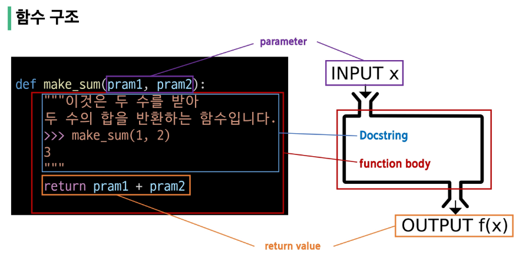
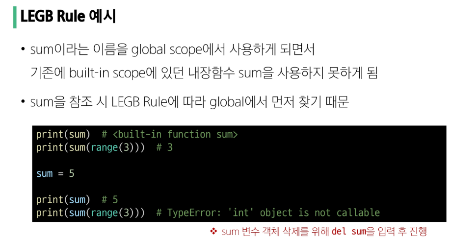
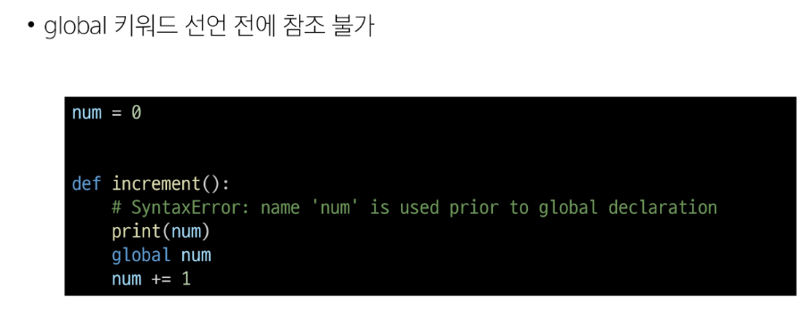
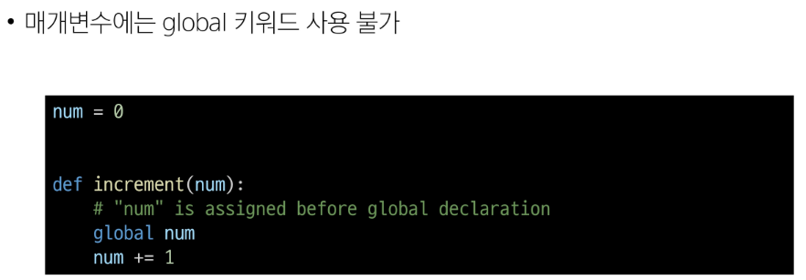
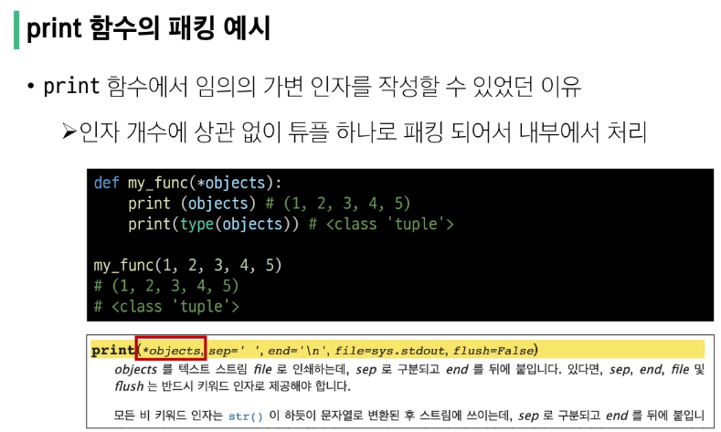
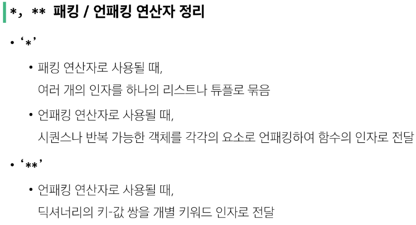

## 함수
 특정 작업을 수행하기 위한 재사용 가능한 코드 묶음

 #### 사용 이유
 - 두 수의 합을 구하는 함수를 정의. 코드의 중복 방지
 - 재사용성 up
 - 코드의 가독성과 유지보수 상향

 ```python
 # 두 수의 합을 구하는 코드
num1 = 5
num2 = 3
sum_result = num1 + num2
print(sum_result)

# 두 수의 합을 구하는 함수
def get_sum(num1,num2):
    return num1 + num2
```
<br/>


함수를 실행하기 위해 함수의 이름을 사용하여 해당 함수의 코드블록을 실행
> funtion_name(arguments)
<br/>


## 함수 구조



### 함수 정의 
= def키워드 작성후 함수 이름 작성, 괄호 안 매개변수(함수에 전달되는 값)

### 함수 body 
= 콜론 다음 들여쓰기된 블록, 함수 실행 시 수행되는 코드

### docstring
= 설명서. 주석 비슷

### 반환 값 
= return 문은 반환할 값을 명시, 함수의 실행을 종료하고 결과를 호출 부분으로 반환
- 함수 내에서 return 문이 없다면 None이 반환됨

+ print()가 반환이 없는 대표적 경우

### 함수 호출  
= 함수를 사용하기 위해 호출. 
'함수의 이름 + 소괄호 활용'
인자(argument) 전달
<br/>


## print() 함수는 반환값이 없다
```python
return_value = print(1)
print(return_value) # None
```
```python
def my_func():
    print('hello')  
    # (return None)
    # 리턴이 없자누. 출력은 하고. 반환은 없음

result = my_func()
print(result) # None
```
- 출력을 담당하는 함수는 결과를 반환하지 않음
<br/>


## 매개 변수 & 인자
- 매개변수 parameter
    - 함수를 정의할 때 함수가 받을 값을 나타내는 변수
- 인자
    - 함수를 호출할 때 실제로 전달되는 값

### 다양한 인자 종류

### 1. Positional Arguments 위치인자

함수 호출 시 인자의 위치에 따라 전달되는 인자

✅**위치인자는 함수 호출 시 반드시 값을 전달해야 함**
```python
def greet(name, age):
    print(f'안녕하세요, {name}님! {age}살이시군요.')


greet('Alice', 25)  # 안녕하세요, Alice님! 25살이시군요.
greet(25, 'Alice')  # 안녕하세요, 25님! Alice살이시군요.
greet(
    'Alice'
)  # TypeError: greet() missing 1 required positional argument: 'age'
```
<br/>

### 2. Default Argument Values 기본인자값
매개변수에 기본값을 할당
호출시 인자를 전달하지 않으면, 기본값이 매개변수에 할당됨됨
```python
def greet(name, age=20):
    print(f'안녕하세요, {name}님! {age}살이시군요.')


greet('Bob')  # 안녕하세요, Bob님! 30살이시군요.
greet('Charlie', 40)  # 안녕하세요, Charlie님! 40살이시군요.
```
<br/>

### 3. Keyword Argument 키워드 인자
함수 호출시 인자의 이름과 함께 값을 전달하는 인자

매개변수와 인자를 일치시키지 않고, 매칭 시켜서 특정 매개변수에 값을 할당

인자의 이름을 명시하면 순서 중요x

✅**단, 호출 시 키워드 인자는 위치인자 뒤에 위치해야함**
```python
def greet(name, age):
    print(f'안녕하세요, {name}님! {age}살이시군요.')


greet(name='Dave', age=35)  # 안녕하세요, Dave님! 35살이시군요.
greet(age=35, name='Dave')  # 안녕하세요, Dave님! 35살이시군요.
greet(age=35, 'Dave')  # Positional argument cannot appear after keyword arguments
```
<br/>

### 4. Arbitrary Argument Lists 임의의 인자 목록
정해지지 않은 개수의 인자를 처리하는 인자

함수 정의할때 매개변수 앞에 '*' 붙여

여러개 인자를 튜플로 묶어 처리
```python
def calculate_sum(*args):
    print(args)  # (1, 100, 5000, 30)  -> 튜플 -내부동작
    print(type(args))  # <class 'tuple'>
```
<br/>

### 5. Arbitrary Keyword Argument Lists 임의의 키워드인자 목록
정해지지 않은 개수의 인자를 처리하는 인자

함수 정의할때 매개변수 앞에 '**' 붙여

여러개 인자를 딕셔너리로 묶어 처리
```python
def print_info(**kwargs):
    print(kwargs)


print_info(name='Eve', age=30)  # {'name': 'Eve', 'age': 30}
```

## 인자 권장 작성 순서!
> 위치 -> 기본 -> 가변 -> 가변 키워드
```python
# 인자의 모든 종류를 적용한 예시
def func(pos1, pos2, default_arg='default', *args, **kwargs):
    print('pos1:', pos1)
    print('pos2:', pos2)
    print('default_arg:', default_arg)
    print('args:', args)
    print('kwargs:', kwargs)


func(1, 2, 3, 4, 5, 6, key1='value1', key2='value2')
"""
pos1: 1
pos2: 2
default_arg: 3
args: (4, 5, 6)
kwargs: {'key1': 'value1', 'key2': 'value2'}
"""
```
<br/>

## ❣️재귀 함수❣️
함수 내부에서 자기자신을 호출하는 함수
```python
def factorial(n):
    # 종료 조건: n이 0이면 1을 반환
    if n == 0:
        return 1
    else:
        # 재귀 호출: n과 n-1의 팩토리얼을 곱한 결과를 반환
        return n * factorial(n - 1)


# 팩토리얼 계산 예시
print(factorial(5))  
# 5*factorial(4)
# =5*4*factorial(3)
# ... = 120
+ callstack 에 호출되어 쌓임. 
누적된거 빠지면서 (base case(종료지점)에 수렴. 없으면 무한정 재귀) 1*2*3*4*5 계산됨
```

- 특징
    - 특정 알고리즘 식 표현 시 변수의 사용이 줄고, 코드의 가독성 up
    - 1개 이상의 base case 존재

- 사용하는 이유
    - 복잡한 문제 간결, 직관적
    - 상황에 따라 반복문보다 간결
    - 수학적 문제 해결결

- 활용 시
    - 종료조건 명확히
    - 반복되는 호출이 종료조건을 향하도록

## 🥐내장 함수🥐
Built-in function
파이썬의 기본 제공 함수

(별도의 import 필요 없어)

- ex) print( )/ len( )
- [pythondocs](https://docs.python.org/3/library/functions.html) 참고
```python
numbers = [1, 2, 3, 4, 5]

print(numbers)  # [1, 2, 3, 4, 5]
print(len(numbers))  # 5
print(max(numbers))  # 5
print(min(numbers))  # 1
print(sum(numbers))  # 15
print(sorted(numbers, reverse=True))  # [5, 4, 3, 2, 1]
```

### 1. map (function, iterable)
순회 가능한 데이터구조의 모든 요소에 함수를 적용,

그 결과를 map object로 반환

```python
numbers = [1, 2, 3]
result = map(str, numbers) 
print(result)  # <map object at 0x00000239C915D760>  
# 리스트에도 str이 적용돼버림
print(list(result))  # ['1', '2', '3']

# map 활용
numbers1 = input().split()
print(numbers1)  # ['1', '2', '3']

numbers2 = list(map(int, input().split())) # map함수로 int를 하나씩 적용시킴
print(numbers2)  # [1, 2, 3]
```

### 2. zip (*iterables) 
='*': 가변인자(임의의)

임의의 iterable을 모아 **튜플**을 원소로 하는 zip object를 반환
```python
girls = ['jane', 'ashley']
boys = ['peter', 'jay']
pair = zip(girls, boys)
print(pair)  # <zip object at 0x000001C76DE58700>
print(list(pair))  # [('jane', 'peter'), ('ashley', 'jay')]
```
- 활용 
    - 여러개의 리스트를 동시에 조회할때
```python
# zip 활용
kr_scores = [10, 20, 30, 50]
math_scores = [20, 40, 50, 70]
en_scores = [40, 20, 30, 50]

for student_scores in zip(kr_scores, math_scores, en_scores):
    print(student_scores)


scores = [
    [10, 20, 30],
    [40, 50, 39],
    [20, 40, 50],
]

for score in zip(*scores):
    print(score)
```

### python 범위 (scope)
함수
- 코드 내부에 local scope
- 그 외 공간(어디에든) global scope
```python
# Scope 예시
def func():
    num = 20
    print('local', num)  # local 20

func()

print('global', num)  # NameError: name 'num' is not defined
```

### 변수 수명주기
수명주기는 변수가 선언되는 위치와 scope에 따라 결정

아래의 순서로 이름을 찾아 나가

LEGB Rule
1. Local scope
2. Enclosed scope
3. Global scope
4. Built-in scope
- 함수 내에서는 바깥 scope의 변수에 접근 가능 
but 수정 불가




```python
# LEGB Rule 퀴즈
a = 1
b = 2

#정의2
def enclosed():
    a = 10
    c = 3

    #정의1
    def local(c):  #매개변수 이름 /= 변수 c
        print(a, b, c)  #10 2 500  
        #a와 b없으니까 한 영역 밖으로

    #호출1
    local(500)
    print(a, b, c)  # 10 2 3

#호출2
enclosed()
print(a, b)  # 1 2
```

### 'global' 키워드
변수의 스코프를 전역 범위로 지정하기 위해 사용

일반적으로 함수 내에서 전역 변수를 수정하려는 경우에 사용 
```python
num = 0  # 전역 변수


def increment():
    global num  # num를 전역 변수로 선언
    num += 1


print(num)  # 0
increment()
print(num)  # 1
```

- 주의사항


<br/>

### 함수 스타일 가이드
SOLID 
- S: 단일 책임원칙
모든 객체는 하나의 명확한 목적과 책임
```python
# 잘못된 설계 예시 = 여러개의 책임
def process_user_data(user_data):
    # 책임 1: 데이터 유효성 검사
    if len(user_data['password']) < 8:
        raise ValueError('비밀번호는 8자 이상이어야 합니다')

    # 책임 2: 비밀번호 암호화 및 저장
    user_data['password'] = hash_password(user_data['password'])
    db.users.insert(user_data)

    # 책임 3: 이메일 발송
    send_email(user_data['email'], '가입을 환영합니다!')


# 올바른 설계 예시 = 책임을 분리한 함수, main 함수로
def validate_password(password):
    """비밀번호 유효성 검사"""
    if len(password) < 8:
        raise ValueError('비밀번호는 8자 이상이어야 합니다')

def save_user(user_data):
    """비밀번호 암호화 및 저장"""
    user_data['password'] = hash_password(user_data['password'])
    db.users.insert(user_data)

def send_welcome_email(email):
    """환영 이메일 발송"""
    send_email(email, '가입을 환영합니다!')

# 메인 함수에서 순차적으로 실행
def process_user_data(user_data):
    validate_password(user_data['password'])
    save_user(user_data)
    send_welcome_email(user_data['email'])
```
<br/>

### Packing
여러 개의 값을 하나의 변수에 묶어 담는 것

- 한 변수에 (,)로 구분된 값을 넣으면 자동으로 튜플로 처리
```python
packed_values = 1, 2, 3, 4, 5
print(packed_values)  # (1, 2, 3, 4, 5)
```

- '*변수명'을 사용하면 나머지 모든 값을 리스트로 묶어서 받을 수 있음
```python
numbers = [1, 2, 3, 4, 5]
a, *b, c = numbers
print(a)  # 1
print(b)  # [2, 3, 4]
print(c)  # 5
```

- '*매개변수'를 사사면 여러개의 인자를 한 변수로 받아 묶을 수 있음

해당 매개변수는 튜플 형태로 취급급
```python
def my_func(*args):
    print(args)  # (1, 2, 3, 4, 5)
    print(type(args))  # <class 'tuple'>


my_func(1, 2, 3, 4, 5)
# (1, 2, 3, 4, 5)
# <class 'tuple'>
```


<br/>

### Unpacking
패킹된 변수를 풀어서 개별 변수나 함수인자로 전달 
```python
packed_values = 1, 2, 3, 4, 5

# 언패킹
a, b, c, d, e = packed_values
print(a, b, c, d, e)  # 1 2 3 4 5
```

```python
# '*'을 활용.
def my_function(x, y, z):
    print(x, y, z)


names = ['alice', 'jane', 'peter']
my_function(*names)  # alice jane peter
```
```python
# '**'활용 (딕셔너리 -> 함수키워드인자)
def my_function(x, y, z):
    print(x, y, z)


my_dict = {'x': 1, 'y': 2, 'z': 3}
my_function(**my_dict)  # 1 2 3
```

#### 정리


#### +Lambda 표현식
간단한 연산, 함수를 한줄로
```python
def addition(x, y):
    return x + y


result = addition(3, 5)
print(result)  # 8


# lambda 표현식으로 작성한 addition 함수
lambda x, y : x + y
```
ex) map함수에서 활용
```python
# with map 함수 #1회성
numbers = [1, 2, 3, 4, 5]


def square(x):
    return x**2 

# lambda 미사용
print(squared1)  # [1, 4, 9, 16, 25]

# lambda 사용
print(squared2)  # [1, 4, 9, 16, 25]
``` 