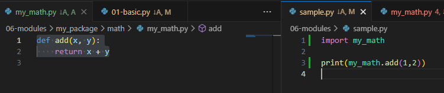
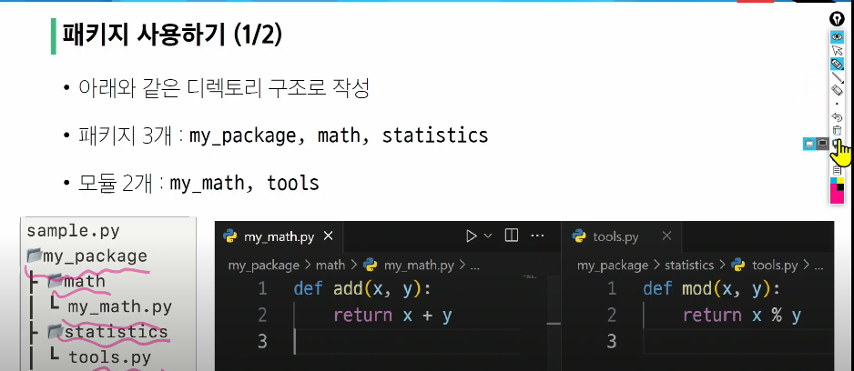
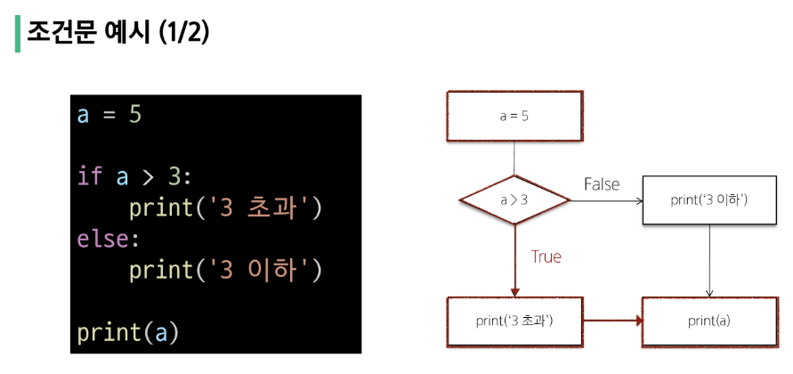

## Modules
모듈: 다른 프로그래머가 이미 작성해놓은 코드
> 한 파일로 묶인 변수와 함수의 모음.

>특정한 기능을 하는 코드가 작성된 파이썬 파일 (.py)

```python 
# math 내장모듈 (math.py)
# 파이썬이 미리 작성해둔 수학 관련 변수와 함수

import math
import random  #난수 생성
import datetime # 시간

print(math.pi) #3.141592
# pi변수

print(math.sqrt(4)) #2.0
# sqrt (square of root)

print(random.randint(1,10)) #랜덤 정수 뽑기, (1에서 10중)

now = datetime.datetime.now()  # 지금시점을 말하는 now라고 하는 함수에 now라는 변수
print(now)
```

### 모듈 가져오는 법
1. import 문 사용
```python
import math
print(math.sqrt(4))
```
2. from 절 사용
```python
from math import sqrt
# 콕집어서 sqrt 만을 가져온다다
print(sqrt(4))
# 모듈을 가져온게 아니라서 
# from 절 math. 사용 안돼
```
> python 스타일 가이드 상 

✅import문 사용 권장!
-> 이름 충돌 방지 

<br/>

### 모듈 사용하기
- .(dot) 연산자
= 점의 왼쪽 객체에서 점의 오른쪽이름을 찾아라

### 주의사항
- 서로 다른 모듈이 같은 이름의 함수를 제공할 경우 문제

- 마지막에 import 된 이름으로 대체 됨
```python
from math import pi, sqrt
from my_math import sqrt
# 그래서 모듈 내 모든 요소를 한번에 import 하는 * 표기는 권장 x
from math import *
```

### as 키워드
as를 사용하여 별칭 alias를 부여
- 두개 이상의 모듈에서 동일한 이름의 변수, 함수클래스 등을 가져올 때 발생하는 이름 충돌을 해결
```python
from math import sqrt
from my_math import sqrt as my_sqrt
sqrt(4)
my_sqrt(4)
```

### 직접 정의한 모듈 사용
단 같은 경로!! 


<br/>

## 파이썬 표준 라이브러리 PSL
파이썬 언어와 함께 제공되는 다양한 모듈과 패키지의 모음

### 패키지
: 연관된 모듈들을 하나의 디렉토리에 모아 놓은것

- 사용 목적 : 모듈들의 이름공간을 구분하여 충돌방지, 모듈의 효율적 사용과 관리

패키지 -> 모듈 여러개로 구성

라이브러리 -> 패키지 여러개로 구성





#### 접근 예시
tools 에서 my_math, tools 접근
 ```python 
from my_package.math import my_math
from my_package.statistics import tools

print(my_math.add(1,2))
print(tools.mod(1,2))
```

### PSL 내부 패키지
설치 없이 바로 import 해서 사용

### ⭐외부 패키지 
online 상의 개발자들의 모듈

pip 를 사용하여 설치 후 import 필요

#### pip
외부 패키지들을 설치하도록 도와주는 파이썬의 패키지 관리 시스템

최신 버전/특정버전/최소버전 명시 설치 가능
```
pip install SomePackage == 1.0.5
```

### requests 외부 패키지 
: ⭐외부 API 서버로 요청
```python
pip install requests

# HTTP 요청을 보낼 수 있도록 도와주는 requests 라이브러리 import
import requests

# 무작위 사용자 정보를 제공해주는 API의 URL
url = 'https://random-data-api.com/api/v2/users'

# requests.get(url)을 통해 API에 요청을 보냄 (request 안에 get 함수)
# 서버로부터 응답(Response)을 JSON 형태로 받아 Python 객체(딕셔너리/리스트 등)로 변환
response = requests.get(url).json()

# 받은 응답 데이터(딕셔너리 형태)를 출력
print(response)
```

<br/>

## 제어문
코드 실행 흐름 제어
 
조건에 따라 코드 블록을 실행하거나 반복적으로 코드를 실행


## 조건문
주어진 조건식을 평가하여 해당 조건이 참인 경우에만 코드 블록을 실행하거나 건너뜀

<br/>

#### if문문
```python
if 표현식:
    코드블록
elif 표현식:  # 선택
    코드블록
else: 
    코드블록
```



```python
# 중첩조건문
dust = 480

if dust > 150:
    print('매우 나쁨')
    if dust > 300:
        print('위험해요!')
elif dust > 80:
    print('나쁨')
elif dust > 30:
    print('보통')
else:
    print('좋음')
```
<br/>

## 반복문
주어진 코드블록을 여러번 반복

### for
특정 작업을 반복적으로 수행

몇번 반복될지 앎.

- 임의의 시퀀스의 항목들을 그 시퀀스에 들어있는 순서대로 반복
```python
for 변수 in 반복가능한 객체:
    코드블록
```


### ❤️ **반복 가능한 객체 (iterable)**

반복문에서 순회할 수 있는 객체
(시퀀스 객체 뿐만 아니라 dict,set 등 포함)
dict와 set는 순서가 없지만. 출력되는 순서는 보장해주어 반복이 가능함

#### 작동 원리
```python
#list
items = ['apple', 'banana', 'coconut']

for item in items:  #복수형으로 변수명 하면 명시적
    print(item)

"""
apple
banana
coconut
"""
```
```python
# 문자열 
country = 'Korea' # 문자열도 시퀀스

for char in country: 
    print(char)
"""
K
o
r
e
a
"""
```
```python
# 딕셔너리

my_dict = {
    'x': 10,
    'y': 20,
    'z': 30,
}

for key in my_dict:
    print(key)
    print(my_dict[key]) #key로 접근해 값이 나옴
"""
x
10
y
20
z
30
"""
```
```python
# 인덱스로 리스트 순회 (알고리즘!!!)
numbers = [4, 6, 10, -8, 5]

for i in range(len(numbers)):
    numbers[i]=numbers[i]*2

print(numbers)  # [8, 12, 20, -16, 10]
```

#### 중첩된 반복문 
print가 호출되는 횟수 
> len(outers) * len(inners)
```python
#이중 for문  #길이만큼 돈다 2x2
outers = ['A', 'B']
inners = ['c', 'd']

for outer in outers:
    for inner in inners:
        print(outer, inner)
"""
A, c
A, d
B, c
B, d  
# 안에가 다 돌아야 다음꺼 가능
"""


elements = [['A', 'B'], ['c', 'd']]

for elem in elements:
    print(elem)  # ['A', 'B'] ['c', 'd']

for elem in elements:
    for item in elem:  # 개별요소 출력하기 위해
        print(item)  # A B c d
```

<br/>

### while
주어진 주건이 참(True)인 동안 반복해서 실행
조건식이 거짓(False)가 될때까지 반복

✅**종료 조건**을 정해줘야함

```python
while 조건식:
    코드블록
```

```python
#예1
a = 0

while a < 3:  # a가 3보다 작아질때까지 도세요
    print(a)
    a += 1   #3번 반복

print('끝')
"""
0
1
2
끝
"""

#예2
number = int(input('양의 정수를 입력해주세요.: '))

while number <= 0:  #양의 정수를 입력해야 끝나 #False가 될때까지. 1 입력시 false
    if number < 0:
        print('음수를 입력했습니다.')
    else:
        print('0은 양의 정수가 아닙니다.')
    number = int(input('양의 정수를 입력해주세요.: '))

print('잘했습니다!')
```

### 각각 언제 쓰나?
1. for
    - 반복 횟수가 명확하게 정해진 경우
    - 리스트, 튜플, 문자열과 같은 시퀀스 형식

2. while
    - 반복 횟수가 불명확거나 조건에 따라 반복을 종료해야 할때
    - 사용자의 입력을 받아 특정조건이 충족될때까지 반복하는 경우

## 반복제어
반복문 내에 일부만 진행할때

```python
# break
# 반복 즉시 중지
for i in range(10):
    if i == 5:
        break
    print(i) # 0 1 2 3 4

# continue
# 다음 반복으로 건너뜀뜀
for i in range(10):
    if i % 2 == 0:
        continue
    print(i)  # 1 3 5 7 9


# pass
# 아무 작업도 하지 않음
for i in range(10):
    pass  
```

```python
# break 예시 2 - "리스트에서 첫번째 짝수만 찾은 후 반복 종료하기"
numbers = [1, 3, 5, 6, 7, 9, 10, 11]

# 첫 번째 짝수를 찾았는지 여부를 저장하는 플래그 변수
# 초기값은 찾지 못했다(False)로 설정
found_even = False  # 플래그변수 T/F값 기준점

for number in numbers:
    if number % 2 == 0:
        print(f'첫번째 짝수 {number}를 찾았습니다.')
        # 짝수를 찾은 상태이므로 True로 변경
        found_even = True
        break


# 반복문이 끝날 때까지 짝수를 찾지 못한 경우
if found_even == False:
    print('짝수를 찾지 못함')
```

```python
# continue 예시 - "리스트에서 홀수만 출력하기"
numbers = [1, 2, 3, 4, 5, 6, 7, 8, 9, 10]

for num in numbers:
    if num % 2 == 0:
        continue
    print(num)

"""
1
3
5
7
9
"""
```

```python
# pass 
# 나중에 쓰거나 , 추가할게 있을때
def my_func(a):
    pass

# 아무런 동장을 수행하지 않아야 할때
if condition:
    pass
else:
    # 다른 동작 수행

# 무한 루프에서 조건이 충족되지 않을때 루프를 계속 진행하기 위해
```

<br/>

## List Comprehension
간결하고 효율적인 리스트 생성 방법

가독성 떨어짐, 남용 x

```python
# 기존 방식
numbers = [1, 2, 3, 4, 5]
squared_numbers = []

for num in numbers:
    squared_numbers.append(num**2) # list에 값 추가
    # 리스트.append(값)

print(squared_numbers) # [ 1, 4, 9, 16, 25]


# 리스트 컴프리헨션
squared_numbers2 = [num**2 for num in numbers]  # 빈리스트 만들 필요도 없음
squared_numbers2 = list(num**2 for num in numbers)

print(squared_numbers2) # [ 1, 4, 9, 16, 25]
```

```python
# 리스트 컴프리헨션 with 조건문
# 기존 방식
evens = []
for x in range(10):
    if x % 2 == 0:
        evens.append(x)

print(evens)  # [0, 2, 4, 6, 8]

# 리스트 컴프리헨션
evens = [x for x in range(10) if x % 2 == 0]
print(evens)  # [0, 2, 4, 6, 8]
```

```python
# 활용 good 예시 
# "2차원 배열 생성 시 (인접행렬 생성 시)"
data1 = [[0] * (5) for _ in range(5)]
print(data1)
# 또는
data2 = [[0 for _ in range(5)] for _ in range(5)]
print(data2)

"""
[[0, 0, 0, 0, 0],
 [0, 0, 0, 0, 0],
 [0, 0, 0, 0, 0],
 [0, 0, 0, 0, 0],
 [0, 0, 0, 0, 0]]
"""
```

<br/>

### ➕리스트 생성 3가지 방법!!!
(loop, list comprehension, map 비교)
```python
"""
1. 기본 loop

특징
- 직관적으로 이해하기 쉽고, 복잡한 로직을 담기에도 용이
- 반복문 내부에서 여러 변수를 업데이트하거나, 특정 조건에 따라 continue/break가 필요한 경우 유리
"""
result1 = []
for i in range(10):
    result1.append(i)


"""
# 2. list comprehension
특징
- 파이썬스러운(Pythonic) 방식으로 간결한 코드 작성 가능
- 조건문을 넣거나, 중첩 for 문을 사용하는 등 다양한 패턴을 구현하기에도 용이
- 가독성을 해치지 않을 선에서 사용하는 것이 중요
"""
result2 = [i for i in range(10)]
# result2 = list(i for i in range(10))


"""
3. map
특징
- 함수형 프로그래밍 스타일을 선호하거나, 이미 정의된 함수를 적용해야 할 때 유용
- 이미 존재하는 함수에 여러 값을 한꺼번에 적용할 때 가독성이 좋아짐
- 복잡한 로직은 map 내부에서 처리하기가 난해하므로, 코드가 오히려 읽기 어려워질 수 있음
"""
result3 = list(map(lambda i: i, range(10)))


"""
<성능 비교>

1. list comprehension
    - 대부분의 경우 가장 빠른 속도를 보임
2. map
    - 특정 상황(예: 기존 함수를 사용할 때, 매우 간단한 변환)의 경우
      list comprehension과 비슷하거나 약간 더 빠른 성능을 보일 수도 있음 (파이썬 버전 및 구현 세부사항에 따라 다름)
3. loop
    - 일반적으로는 list comprehension이나 map에 비해 조금 더 느린 경향을 보였지만
      python 버전이 올라가면서 다른 방식과 비슷하거나 때로는 더 나은 결과를 보이기도 함

결론
- 성능 차이는 대부분의 경우 미미하므로, 
  미세한 차이가 아니라면, 가독성과 유지보수성이 성능보다 더 중요
"""
```

### ➕ enumerate(iterable, start=0)
iterable 객체의 요소와 인덱스 함께 반환
```python
fruits = ['apple', 'banana', 'cherry']

for index, fruit in enumerate(fruits):
    print(index, fruit) #(index,요소소)

"""
0 apple
1 banana
2 cherry
"""

for index, fruit in enumerate(fruits, 3): # 스타트 지정
    print(index, fruit)

"""
3 apple
4 banana
5 cherry
"""
```


