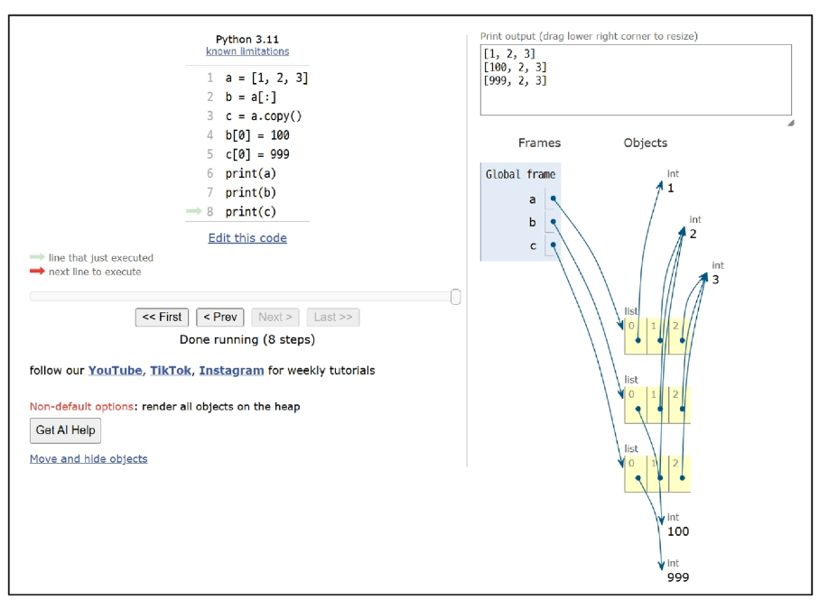
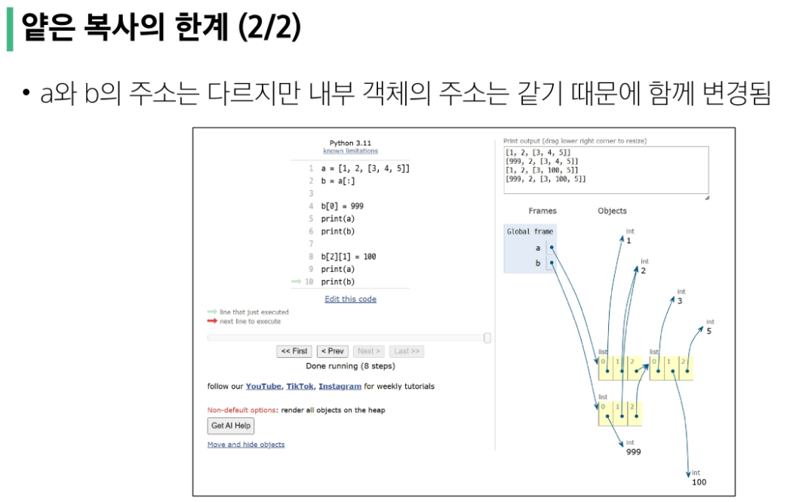

# 자료구조
각 데이터의 효율적인 저장, 관리를 위한 구조를 나눠 놓은 것

### 데이터 구조 활용
문자열, 리스트, 딕셔너리 등 각 데이터 구조의 메서드를 호출하여 다양한 기능 활용

## 메서드
객체에 속한 함수
- 객체의 상태를 조작하거나 동작을 수행

메서드는 클래스 내부에 정의되는 함수. 어떠한 것에 속한 함수

클래스는 파이썬에서 '타입을 표현하는 방법'

> 데이터 타입 객체.메서드()

```
'hello'.capitalize()
```

```python 
#문자열 메서드 예
print('hello'.capitalize())  # Hello   #괄호!!()로 호출
```

## 문자열 조회/탐색 및 검증 메서드
안에 파라미터 필요없는 경우도 있어!

### 1.  .find(x)
x의 첫 번째 위치를 반환, 
없으면 -1을 반환
```python 
# find
text = 'banana'
print(text.find('a'))  # 1   # 첫번째로 등장하는 a의 위치
print(text.find('z')) # -1   # 못찾으면 -1  
```

### 2.  .index(x)
x의 첫번째 위치를 반환, 없으면 오류
```python
# index
print(text.index('a')) # 1
print(text.index('z')) # 코드 중단, value 에러
```

### 3. .isupper(x)  / .islower(x)
is로 시작하는 애들 특징 => 반환 값이 Boolean
```python 
# isupper
string1 = 'HELLO'
string2 = 'Hello'
print(string1.isupper())  # True
print(string2.isupper())  # False

# islower
print(string1.islower())  # False
print(string2.islower())  # False
```

### 4. .isalpha(x)
문자열이 알파벳으로만 이루어져있나
```python
# isalpha
string1 = 'Hello'
string2 = '123heis98576ssh'
print(string1.isalpha())  # True
print(string2.isalpha())  # False
```
<br/>

## 문자열 조작 메서드 (새 문자열 반환) 
문자는 불변의 데이터 타입
### ⭐ 1. .replace(old, new[,count])
바꿀 대상 글자를 새로운 글자로 바꿔서 반환.  

count는 선택적 인자. []는 기술문서 쓸때,, 파이썬 아님
```python
# replace
text = 'Hello, world! world world'
new_text1 = text.replace('world','Python')
new_text2 = text.replace('world','Python', 1)  # 바꿀 개수
print(new_text1)  # Hello, Python! Python Python
print(new_text2)  # Hello, Python! world world

print(text)  
#원본은 'Hello, world! world world'  
# 바뀌지 않음. 문자열 불변
```

### ⭐2.  .strip([char])
문자열의 시작과 끝에 있는 공백 혹은 지정한 문자를 제거
```python 
# strip
text = '  Hello, world!  '
new_text = text.strip()
print(new_text)  # 'Hello, world!'
```

### ⭐3.  .split(sep=None, maxsplit=1)
sep를 구분자 문자열로 사용하여 문자열에 있는 단어들의 리스트 반환

쪼개서 요소를 리스트로
```python 
# split
text = 'Hello, world!'
words1 = text.split(',')
words2 = text.split()
print(words1)  # ['Hello', ' world!']
print(words2)  # ['Hello,', 'world!']  # sep 지정없으면 공백을 기준으로!
```

### ⭐4.  *'separator'* .join(*iterable*)
iterable의 문자열을 연결한 문자열을 반환 
join을 쓰려면 안에 있는걸 다 문자열로 바꾸고 써야함
```python 
# join
words = ['Hello', 'world!']
new_text = '-'.join(words)
print(new_text)  # Hello-world!

words = ['Hello', 'world!', 3, 100]  #Error: int found 숫자 못쓰는 구나~
```

#### 그 외
```python 
# capitalize
text = 'heLLo, woRld!'
new_text1 = text.capitalize()
print(new_text1)  # Hello, world!

# title
new_text2 = text.title()
print(new_text2)  # Hello, World!

# upper
new_text3 = text.upper()
print(new_text3)  # HELLO, WORLD!

# lower
new_text4 = text.lower()
print(new_text4)  # hello, world!

# swapcase
new_text5 = text.swapcase()
print(new_text5)  # HEllO, WOrLD!
```
<br/>

## 리스트 값 추가 및 삭제 메서드
원본이 바뀜!! 리스트는 가변~

새로운 변수를 가져올 필요가 없음.

따라서 반환값이 없음


### ⭐ .append(x)
리스트 마지막에 항목 x를 추가
```python
# append
my_list = [1, 2, 3]
my_list.append(4)
print(my_list)  # [1, 2, 3, 4]
print(my_list.append(4))  # None
# append함수는 리턴이 없다
```

### ⭐ .extend(*iterable*)
리스트에 다른 반복가능한 객체의 모든 항목을 추가
- +=과 같은 기능
[1,2,3]+=[4,5,6]

```python
# extend
my_list = [1, 2, 3]
my_list.extend([4,5,6])
print(my_list)  # [1, 2, 3, 4, 5, 6]

my_list.extend(5)   # 정수 객체는 반복가능하지 않음
# 반복가능한 객체가 아니면 추가불가

# append와의 비교
my_list.append([4,5,6])
print(my_list) # [1,2,3,4,5,6 [4,5,6]]
```

###  .insert(i, x)
지정한 인덱스 i 위치에 항목 x 삽입
```python
# insert
my_list = [1, 2, 3]
my_list.insert(1,5)
print(my_list)  # [1, 5, 2, 3]
```

###  .remove(x)
리스트에서 첫번째로 일치하는 항목을 삭제
```python
# remove
my_list = [1, 2, 3, 2, 2, 2]
my_list.remove(2)
print(my_list)  # [1, 3, 2, 2, 2]
```

### ⭐  .pop(i)
리스트에서 지정한 인덱스의 항목을 제거하고 ❤️반환

작성하지 않을 경우 마지막 항목을 제거
```python
# pop
my_list = [1, 2, 3, 4, 5]
item1 = my_list.pop()
item2 = my_list.pop(0)

print(item1)  # 5
print(item2)  # 1 
print(my_list)  # [2, 3, 4]
```

### .clear()
리스트의 모든 항목 삭제
```python
# clear
my_list = [1, 2, 3]
my_list.clear()   #-> None
print(my_list)  # []
```

## 리스트 탐색 및 정렬 메서드

### .index(x)
리스트에서 첫번째로 일치하는 항목 x의 인덱스를 반환
```python
# index
my_list = [1, 2, 3]
index = my_list.index(2)
print(index)  # 1
```

### .count(x)
리스트에서 항목 x의 개수를 반환
```python
# count
my_list = [1, 2, 2, 3, 3, 3]
counting_number = my_list.count(3)
print(counting_number)  # 3
```

### ⭐ .reverse()
리스트의 순서를 역순으로 변경 (정렬 x)
```python
# reverse
my_list = [1, 3, 2, 8, 1, 9]
my_list.reverse()
print(my_list.reverse())  # None. 반환은 없어. 자체를 print하면 None
print(my_list)  # [9,1,8,2,3,1]
```

### ⭐.sort()
원본 리스트를 오름차순으로 정렬
```python
# sort
my_list = [3, 2, 100, 1]
my_list.sort()
print(my_list)  # [1, 2, 3, 100]

# sort(내림차순 정렬)
my_list.sort(reverse=True)  # reverse는 boolean 값. 기본인자가 false
print(my_list)  # [100, 3, 2, 1]
```
<br/>

# 복사
## 객체와 참조
1. 가변 객체 (✅복사에서 주의)
- 리스트, 딕셔너리, 집합
- 생성 후에도 그 내용 수정가능
- 내용 변경되어도 같은 메모리 주소 유지
- 크기가 큰 데이터를 효율적으로 수정

2. 불변 객체
- 정수, 실수, 문자열 
- 생성 후 그 값을 변경할 수 없음
- 새로운 값을 할당하면 새로운 객체 생성, 변수는 새 객체를 참조
- 동일한 값을 가진 여러 객체가 메모리 공유로 효율적

### 변수 할당
객체에 대한 참조를 생성하는 과정
- 변수는 객체의 메모리 주소를 가리키는 label 역할
- '=' 연산자를 사용하여 변수에 값을 할당
- 할당 시 새로운 객체가 생성되거나 기존 객체에 대한 참조가 생성됨


### 메모리 참조 방식
변수는 객체의 '메모리 주소'를 저장

여러변수가 동일한 객체를 참조 할 수 있음
```python
# ================================================
# 가변(mutable) 객체 예시
# ================================================
print('가변(mutable) 객체 예시')
a = [1, 2, 3, 4]
b = a     # 복사가 아니라 같은 주소를 할당한 것임
b[0] = 100

print(f'a의 값: {a}')  # [100, 2,3,4]
print(f'b의 값: {b}')  # [100, 2,3,4]
print(f'a와 b가 같은 객체를 참조하는가? {a is b}')  # True

# ================================================
# 불변(immutable) 객체 예시
# ================================================
print('\n불변(immutable) 객체 예시')
a = 20
b = a
b = 10

print(f'a의 값: {a}')  # 20
print(f'b의 값: {b}')  # 10
print(a is b)  # False

# ================================================
# id() 함수를 사용한 메모리 주소 확인
# ================================================
print('\n메모리 주소 확인')
x = [1, 2, 3]
y = x   # y에 x를 할당
z = [1, 2, 3]

print(f'x의 id: {id(x)}')  #1644~4
print(f'y의 id: {id(y)}')  #1644~4
print(f'z의 id: {id(z)}')   #1644~0
print(f'x와 y는 같은 객체인가? {x is y}') # True
print(f'x와 z는 같은 객체인가? {x is z}') # False 모습만 같음
```

### 얕은 복사
객체의 최상위 요소만 새로운 메모리에 복사하는 방법

내부에 중첩된 객체가 있다면 그 객체의 참조만 복사됨

1. 리스트 슬라이싱
2. copy() 메서드
3. list() 함수

```python
# ================================================
# 얕은 복사
# ================================================
print('\n얕은 복사 예시')

# 1차원 리스트
a = [1, 2, 3]
b = a[:]  # 슬라이싱
c = a.copy()  # copy() 메서드
d = list(a)  # list() 함수
# 

b[0] = 100  #0번째 index를 100으로 바꿔
c[0] = 999
d[0] = 8080
print(a)  # [1,2,3]
print(b)  # [100,2,3]
print(c)  #[999,2,3]
print(d)  # [8080,2,3]
```


#### 얕은 복사의 한계
최상위까지만 복사, 내부 리스트는 여전히 원본과 같은 객체 참조
```python
# 다차원 리스트
print('\n다차원 리스트 얕은 복사의 한계')
a = [1, 2, [3, 4, 5]]
b = a[:]

b[0] = 999
print(a)  # [1, 2, [3, 4, 5]]
print(b)  # [999, 2, [3, 4, 5]]

b[2][1] = 100
print(a)  #
print(b)  #
print(f'a[2]와 b[2]가 같은 객체인가? {a[2] is b[2]}')  # True
```



### 깊은 복사
객체의 모든 수준의 요소를 새로운 메모리에 복사
중첩된 객체까지 모두 새로운 객체로 생성됨
```python
# ================================================
# 깊은 복사
# ================================================
import copy

print('\n깊은 복사 예시')
a = [1, 2, [3, 4, 5]]
b = copy.deepcopy(a)

b[2][1] = 100
print(a)  # [1, 2, [3, 4, 5]]
print(b)  # [1, 2, [100, 4, 5]]
print(f'a[2]와 b[2]가 같은 객체인가? {a[2] is b[2]}')  # False

# 복잡한 중첩 객체 예시
print('\n복잡한 중첩 객체 깊은 복사')
original = {
    'a': [1, 2, 3],
    'b': {
        'c': 4,
        'd': [5, 6],
    },
}
copied = copy.deepcopy(original)

copied['a'][1] = 100
copied['b']['d'][0] = 500

print(f'원본: {original}')  # 원본: {'a': [1, 2, 3], 'b': {'c': 4, 'd': [5, 6]}}
print(f'복사본: {copied}')  # 복사본: {'a': [1, 100, 3], 'b': {'c': 4, 'd': [500, 6]}}
print(
    f'original["b"]와 copied["b"]가 같은 객체인가? {original["b"] is copied["b"]}' 
)  # False
```
<br/>

## ➕메서드 체이닝 
- None을 반환하는 메서드는 메서드 체이닝 불가능

ex) 리스트의 append(), sort()
```python
# 문자열 메서드 체이닝
text = 'heLLo, woRld!'
new_text = text.swapcase().replace('l', 'z')
print(new_text)  # HEzzO, WOrLD!


# 1. 단계별로 실행하기
text = 'heLLo, woRld!'
step1 = text.swapcase()
print('1단계 결과:', step1)  # HEllO, WOrLD!

step2 = step1.replace('l', 'z')
print('2단계 결과:', step2)  # HEzzO, WOrLD!

# 2. 한 줄로 실행하기 (위와 동일한 결과)
new_text = text.swapcase().replace('l', 'z')
print('최종 결과:', new_text)  # HEzzO, WOrLD!


# 리스트 메서드 체이닝 예시

# 잘못된 체이닝 방식 1
numbers = [3, 1, 4, 1, 5, 9, 2]
result = numbers.copy().sort()
print(result)  # None (sort()는 None을 반환하므로 체이닝이 중단됨)
print(numbers)  # [3, 1, 4, 1, 5, 9, 2] (원본은 변경되지 않음)

# 잘못된 체이닝 방식 2
result = numbers.append(7).extend([8, 9])  # AttributeError
# append가 반환값이 없어서.. None
# None.extend() 가 되버림

# 개선된 방식
# 리스트 조작에서 메서드 체이닝을 사용할 때는 각 메서드가 적절한 값을 반환하는지 확인하고,
# 필요한 경우 새로운 리스트 객체를 반환하는 함수를 사용하는 것이 좋음
sorted_numbers = sorted(numbers.copy())  # 내장함수의 sorted. 반환값이 있음
print(sorted_numbers)  # [1, 1, 2, 3, 4, 5, 9]
```