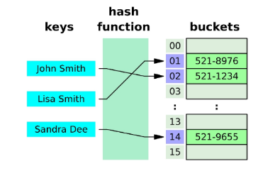
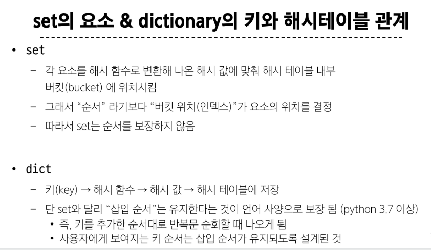
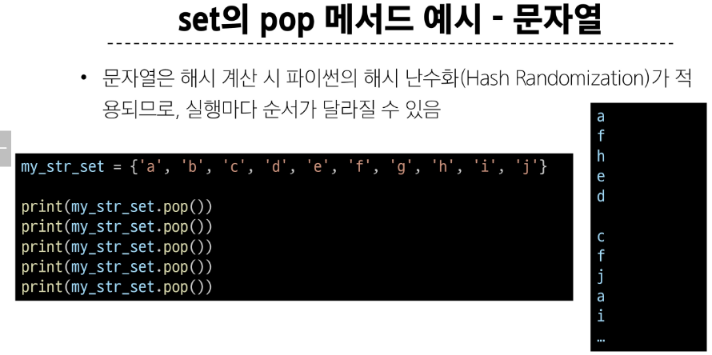
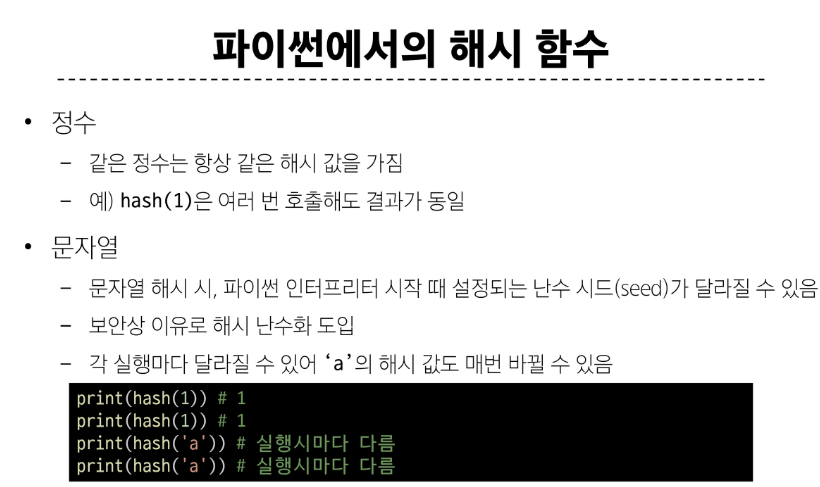
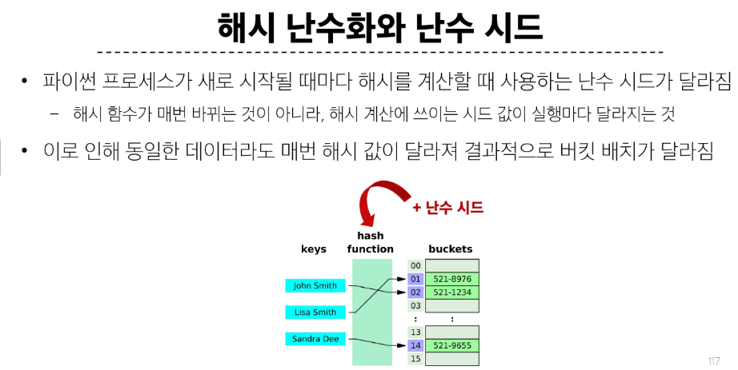
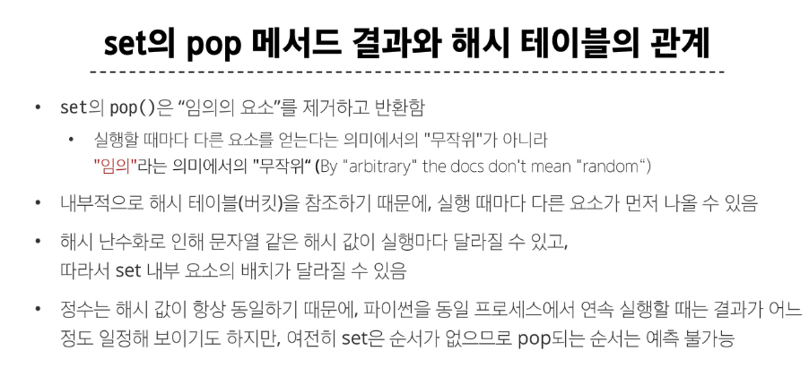

## 딕셔너리
### 특징
1. 키 - 값으로 쌍을 이루고 있다
2. 순서가 없다
3. {} 로 만든다
4. 키는 고유해야한다. 중복x
    
    a. 키는 immutable 한 타입만 올수 있다. (예: 문자열 등)
5. 값은 어떤 것도 다 허용
6. 가변형

<br/>

```python
# 딕셔너리 생성
my_dict = {}
my_dict2 = dict() # dict함수 # 빈 딕셔너리를 반환 return {} 
my_dict3 = {'name':'Alice', 'age':25} # 초기화(초기값을 준 상태로)

➕
# 메서드 vs 함수
print(type(my_dict3)) # dict
print(dir(my_dict3)) # 정의되는, 구현되는 거에 따라 다르게 부름?
```
```python
# .clear() 
#딕셔너리의 모든 키/값 쌍을 제거
print(my_dict3)
my_dict3.clear()
print(my_dict3) #{}
  
#.get(key[,default])  
# []는 선택사항
# 키 연결된 값을 반환하거나 키가 없으면 **None 혹은 기본 값을 반환**
print(my_dict3.get('name'))  # Alice
```

```python
# keys(), values(), items()
# 얘들의 공통점: 딕셔너리에 있는 특별한 view 객체
# 원본 객체의 실시간 상태를 반영해서 보여줌

person = {'name': 'Alice', 'age': 25, 'gender': 'Female'}

print(person.keys())  # dict_keys(['name','age','gender'])
print(person.items())  # dicy_items([('name','Alice'),('age': 25),('gender': 'Female')])
# list() 형변환
print(person.values()) # dict_values(['Alie', 25, 'Female'])

print(type(person.keys())) # <class 'dict_keys'>
print(type(person.items())) # <class 'dict_items'>
print(type(person.values())) # <class 'dict_values'>
```


✅인덱스 접근은 불가하다 = dict는 순서가 없다

단, dict은 삽입순서가 보장!

list()로 형변환을 해서 접근은 할 수 있다

```python
# .pop(k)  , .pop(k[,default])
# 키 k를 제거하고 연결됐던 값을 반환(**없으면 오류**get과의 차이점)
print(person.pop('name')) # Alice
print(person) #{'age': 25, 'gender': 'Female'}
```

```python
# .setdefault()
# 키와 연결된 값을 반환, 키가 없다면 default와 연결한 키를 딕셔너리에 추가하고 default를 반환
student={'name':'isaac'}
print(student.setdefault('age',20))  # 20
print(student) #{'name': 'isaac', 'age': 20}
print(student.setdefault('name','kim')) #isaac
```

```python
# .update([other])
# other가 제공하는 키/값 쌍으로 딕셔너리를 갱신, 기존 키는 덮어씀
```

<br/>

## Set
### 특징
1. 중복 없음
2. 순서 없음
3. 해시가 가능한 객체만 담을 수 있다
4. Mutable

```python
# 세트 생성
my_set = {'a','b','c', 1, 2, 3}
my_set1 = set()
my_set2 = set([1,2,3,4])  # 중복요소가 있다면 중복요소가 없어짐
```
```python
# add(x)
my_set.add('d')
print(my_set) # {1, 2, 3, 'c', 'a', 'd', 'b'}
my_set.clear()
print(my_set) # set()

# remove(x)
my_set.remove('d')
print(my_set) #keyError
my_set.remove('x')

# pop()
# 세트에서 **임의의 요소**를 제거하고 반환
el = my_set.pop()
print(el) # 1
print(my_set) # {2, 3, 'b', 'c', 'a'}
# 왜 pop 1만 나오는것 처럼 보이냐~ 반환하는게 임의의값이 아님.해시테이블 key값이 저장되고 그걸 검색해서 찾는거라
# 난수화- 다시 실행될 경우 임의의 key값이 다시 저장되어 다른 값이 나올 것

# .discard()
my_set.discard(2)
print(my_set) # {1, 3, 'a', 'c', 'b'}
my_set.discard(10) # 에러 없음

# .update(iterable)
my_set.update([1,4,5])
print(my_set) # {1, 2, 3, 4, 'c', 5, 'a', 'b'}
```

<br/>

## 해시 테이블
해시 함수를 사용하여 변환한 값(key)을 인덱스로 삼아 키와 데이터(값)를 저장하는 자료구조
- "일반화"
- 데이터를 빠르게 저장하고 검색하기 위해 사용 (set과 dict이)

### 원리
1. 키를 해시함수를 통해 해시 값(고유값)으로 변환 
2. 변환된 해시 값을 인덱스로 삼아 데이터를 저장하거나 찾는다
3. 이로 인해 검색, 삽입, 삭제가 매우 빠르게 수행 


단순화된 해시테이블


⭐
해시 충돌 방지. 

set.pop()의 경우의 예가 set이 순서를 보장하지 않음을 확인가능
- 문자열은 해시 계산시 파이썬의 해시 난수화가 적용되므로 실행마다 순서가 달라질 수 있음






### hashable
hash()함수에 넣어 해시 값을 구할 수 있는 객체를 의미
- 대부분의 불변타입은 해시 가능
- 가변형 객체 (리스트,dict,set)는 기본적으로 해시 불가능
    - 값이 변하면 해시값도 달라질 수 있어 해시 테이블 무결성이 깨짐

