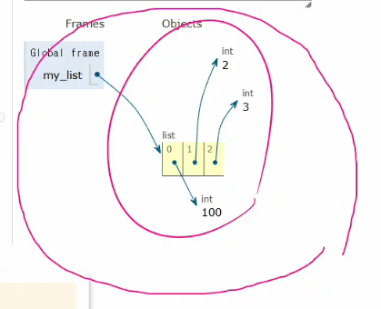

#### Sequence type
## ❣️2. 리스트❣️
여러 개의 값을 순서대호 저장하는 **변경 가능한⭐** 시퀀스 자료형  
😂얘만 가변?

#### 리스트 표현
데이터는 어떠한 자료형도 저장가능
```python
my_list_1 = []
my_list_2 = [1, 'a', 3.5, 'b', 5]
my_list_3 = [1, 2, 3,'Python', ['hello', 'world']]
```
### 리스트의 시퀀스 특징
```python
my_list = [1, 'a', 3, 'b', 5]
# 인덱싱
print(my_list[1])  # a

# 슬라이싱
print(my_list[2:4])  # [3, 'b']
print(my_list[:3])  # [1, 'a', 3]
print(my_list[3:])  # ['b', 5]
print(my_list[0:5:2])  # [1, 3, 5]
print(my_list[::-1])  # [5, 'b', 3, 'a', 1]  #오름/내림차순 아니구 걍 거꾸로

# 길이
print(len(my_list))  # 5

# 중첩된 리스트 접근
my_list = [1, 2, 3, 'Python', ['hello', 'world', '!!!']]
print(len(my_list))  #5  요소가 몇개!
print(my_list[4][2])  # !!! #print(my_list[4][-1])
print(my_list[4][1][0])  # w  #print(my_list[-1][-1][0])

# 리스트는 가변
my_list = [1, 2, 3]
my_list[0] = 100
print(my_list) # [100, 2, 3]  # str 은 안됐지만 list는 가변
```
리스트 = [주소0, 주소1, 주소2]

<br/>

#### ➕ 3. 튜플 Tuple
여러개의 값을 순서대로 저장하는 변경 불가능한 시퀀스 자료형
- 0개 이상의 객체를 포함하며 데이터 목록을 저장
- 소괄호 (()) 표기
- 어떠한 자료형도 저장 가능
- 단일 요소 튜플 만들때 **후행 쉼표!**
    - (1) -> int 
    - (1,) -> tuple
```python
# 튜플 표현
my_tuple_1 = ()
my_tuple_2 = (1,)
my_tuple_3 = (1, 'a', 3, 'b', 5)
```

> 언제 사용하나?

개발할때 거의 안씀.

불변 특성을 사용하여 **✅내부 동작**과 안전한 데이터 전달에 사용. 내부적으로 알아서 ~

다중 할당. 값교환, 그룹화, 함수 다중 반환 값 등

ex
```python
# 다중 할당 
x, y = 10, 20  #괄호 있어도 되고,,
print(x)  # 10
print(y)  # 20
# 실제 내부 동작
(x, y) = (10, 20)

# 값 교환
x, y = 1, 2
x, y = y, x
# 실제 내부 동작
temp = (y, x)  # 튜플 생성
x, y = temp  # 튜플 언패킹
print(x, y)  # 2 1

# 그룹화
student = ('Kim', 20, 'CS')
name, age, major = student  # 언패킹
print(name, age, major)  # Kim 20 CS
```
<br/>

## 3. range
연속된 정수 시퀀스를 생성하는 변경 불가능한 자료형
- 모든 매개변수는 정수만 사용가능

함수 형태
```python
range(시작값, 끝값, 증가값)  #slicing 과 비슷?
```
<br/>

#### range 매개변수별 특징
- range(n)
    - 0부터 n-1까지 1씩 증가
```python
my_range_1 = range(5)
```

- range(n,m)
    - n부터 m-1까지의 1씩 증가
```python
my_range_2 = range(1, 10)
```
- range(n, m, step)
    - n부터 m-1까지의 1씩 증가
```python
my_range_3 = range(5, 0, -1)
```


```python
print(my_range_1)  # range(0, 5)
print(my_range_2)  # range(1, 10)
print(my_range_3)  # range(5, 0, -1)

# 리스트로 형 변환 시 데이터 확인 가능
print(list(my_range_1))  # [0, 1, 2, 3, 4]
print(list(my_range_2))  # [1, 2, 3, 4, 5, 6, 7, 8, 9]
print(list(my_range_3))  # [5, 4, 3, 2, 1]
```

#### 증가 값 규칙
- 기본 증가값 1
- 음수 증가값 - 감소하는 수열 생성
- 양수 증가값 - 증가하는 수열 생성
- 증가값 0 = 에러

#### 값의 범위 규칙
- 음수 증가시 - 시작 값이 끝값보다 크기
- 양수 증가시 - 시작 값이 끝보다 커야함
```python
# 음수 증가 시
# 시작 값이 끝 값보다 큰 경우 (정상)
print(list(range(5, 1, -1)))  # [5, 4, 3, 2]
# 시작 값이 끝 값보다 작은 경우
print(list(range(1, 5, -1)))  # []


# 양수 증가 시
# 시작 값이 끝 값보다 작은 경우 (정상)
print(list(range(1, 5)))  # [1, 2, 3, 4]
# 시작 값이 끝 값보다 큰 경우
print(list(range(5, 1)))  # []
```

```python
# 주로 반복문과 함께 활용 예정
for i in range(1, 10):
    print(i)  # 1 2 3 4 5 6 7 8 9  #9번반복복

for i in range(1, 10, 2):
    print(i)  # 1 3 5 7 9
```